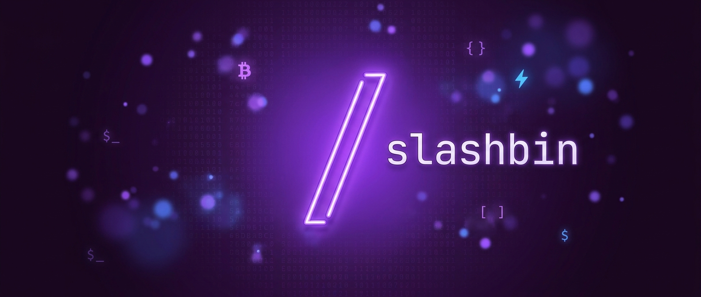

  

# Hi, I'm slashbin 👋

I build **tools** — small, focused, self-hostable software, with a soft spot for **Bitcoin & Lightning**.
Mostly solo, AI-native, shipping fast across TypeScript, Go, Rust, Swift and Solidity.

---

### 🧩 Self-hosted apps — the `slash*` suite

- 🟪 **[slashnode](https://github.com/slashbinslashnoname/slashnode)** — Self-hostable home base that runs the `slash*` apps on your own box.
- 💬 **[slashslack](https://github.com/slashbinslashnoname/slashslack)** — A Slack you actually own: realtime team chat, easy to install, lives on your server.
- 🧠 **[slashmem](https://github.com/slashbinslashnoname/slashmem)** — Local procedural memory for AI agents (Rust + SQLite): rules learned from experience that gain/lose confidence and resurface when relevant.
- 🖼️ **[slashscreen](https://github.com/slashbinslashnoname/slashscreen)** — Desktop app to beautify your screenshots for social media.
- ⏰ **[slash-cron](https://github.com/slashbinslashnoname/slash-cron)** — A GUI to monitor and edit your crontab.

### ⚡ Bitcoin & Lightning

- 🛡️ **[sentinelle](https://github.com/slashbinslashnoname/sentinelle)** — Self-hosted Bitcoin invoicing gateway: time-boxed invoices payable on-chain (watch-only xpub) and over Lightning (phoenixd), with a React admin, realtime WebSocket payment events and accounting export.
- ⚡ **[slashtip](https://github.com/slashbinslashnoname/slashtip)** — Lightning tipping device on a Raspberry Pi Zero 2 W + Whisplay hat.
- 🛒 **[p2p-telegram-bitcoin-shop](https://github.com/slashbinslashnoname/p2p-telegram-bitcoin-shop)** — Telegram bot to sell Bitcoin over Lightning via BTCPay Server.
- 📡 **[go-opreturn](https://github.com/slashbinslashnoname/go-opreturn)** — Build & broadcast Bitcoin transactions with custom OP_RETURN data (mainnet/testnet, SegWit, mempool.space).
- 👛 **[tsunami-wallet](https://github.com/slashbinslashnoname/tsunami-wallet)** — Mobile wallet that derives addresses from an xpub.
- 🎁 **[bitcoin-xpub-donations](https://github.com/slashbinslashnoname/bitcoin-xpub-donations)** — Self-hosted donation page generating a fresh address per visitor from your xpub (Next.js + WebSocket).
- 🔭 **[bitcoin-transaction-visualizer](https://github.com/slashbinslashnoname/bitcoin-transaction-visualizer)** — Watch Bitcoin transactions render live as they hit the mempool.
- 🔳 **[bitcoin-qrcode](https://github.com/slashbinslashnoname/bitcoin-qrcode)** — Bitcoin payment QR-code generator.
- 📱 **[reactnative-bitcoinjslib-boilerplate](https://github.com/slashbinslashnoname/reactnative-bitcoinjslib-boilerplate)** — Starter for React Native + bitcoinjs-lib.
- 🎟️ **[satoshipriceticker](https://github.com/slashbinslashnoname/satoshipriceticker)** — Shows the price of $1 in satoshis (Bitstamp).

### 🌐 Nostr, ZK & decentralization

- 🌿 **[nostr-infrastructure](https://github.com/slashbinslashnoname/nostr-infrastructure)** — Full stack to run a Nostr client: relay + WoT/spam write-policy, db, cache, MinIO media, spam-ML, indexer + search, admin site, Caddy and backups.
- 🗳️ **[poseidon2-anonymous-voting-contracts](https://github.com/slashbinslashnoname/poseidon2-anonymous-voting-contracts)** — Anonymous on-chain voting in Solidity using Poseidon2 hashing.
- 📜 **[gnoland_cheatsheet](https://github.com/slashbinslashnoname/gnoland_cheatsheet)** — Onboarding cheatsheet for interacting with gno.land.

### 🛠️ Dev tools & utilities

- 🌳 **[septentrion](https://github.com/slashbinslashnoname/septentrion)** — Desktop Git client: workspaces, diffs, issues & PRs in one app (Electron · React · TS · Tailwind · shadcn/ui).
- 📝 **[grokimarkdown](https://github.com/slashbinslashnoname/grokimarkdown)** — Turn Wikipedia / Grokipedia pages into clean Markdown for LLMs.
- 🪟 **[screenshotnotch](https://github.com/slashbinslashnoname/screenshotnotch-public)** — macOS app that tucks your latest screenshots into the notch.
- 🍅 **[pomodoro](https://github.com/slashbinslashnoname/pomodoro)** — A simple, no-nonsense Pomodoro timer.
- ⚛️ **[electron-webpack-react-quickstart](https://github.com/slashbinslashnoname/electron-webpack-react-quickstart)** — Boilerplate for Electron + React + Webpack.
- ⏱️ **[slash.benchmark](https://github.com/slashbinslashnoname/slash.benchmark)** — Tiny Node.js helper to measure processing times.
- 🔑 **[password-handler](https://github.com/slashbinslashnoname/password-handler)** — Shell script to copy a password into your clipboard.
- 📷 **[organize-icloud-google-photos](https://github.com/slashbinslashnoname/organize-icloud-google-photos)** — Scripts to move Google Photos / iCloud libraries onto an HDD.
- 🚀 **[dogecoin-docker](https://github.com/slashbinslashnoname/dogecoin-docker)** — CI that polls Dogecoin Core releases daily and auto-builds multi-arch Docker images to GHCR.

### 📈 Trading & markets

- 🕯️ **[morning-chart-brew](https://github.com/slashbinslashnoname/morning-chart-brew)** — Fresh 4h candles from TradingView, every morning.
- 📊 **[quant-display](https://github.com/slashbinslashnoname/quant-display)** — Market displayer with chart-pattern recognition.

### 🧪 Earlier & for fun

- 🐦 **[tipFollowers](https://github.com/slashbinslashnoname/tipFollowers)** — A Twitter bot that tips every follower of a given account.
- 🚗 **[licence-plate-reader](https://github.com/slashbinslashnoname/licence-plate-reader)** — Lightweight licence-plate reader.
- ⛏️ **[kawpow-miner-osx](https://github.com/slashbinslashnoname/kawpow-miner-osx)** — KawPow miner for macOS.

---

### 📫 Connect

Most of my older work lived on GitLab — don't mind the sparse early history.
